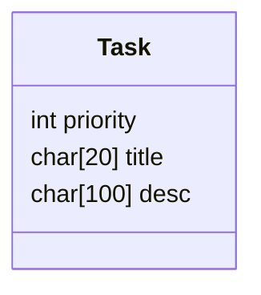

# Todo manager app

---


---

 - Shows list of todos
 - Shows the most important ones at the top (highest priority = 5, lowest = 0)

 `todos list`

```
 1. Algo HW:    Skiena ch2 2.1->2.50 even numbers
 2. OS HW:      notes from SEAB ch2
 3. TITLE:      DESC
```

 - Adds todos to the list according the correct position in the list
`todos add`

```
title:
Algo HW
description:
Skiena ch2 2.1->2.50 even numbers
priority:
5
Task added...
//shows list
```

 - Allows deletion of todos (after done)
`todos done 1`

```
Finished task 1
Algo HW:    Skiena ch2 2.1->2.50 even numbers
```

- Changes todo title
`todos title 1`

```
Change todo 1 - TITLE
NEW_TITLE
```

- Changes todo description
`todos desc 1`

```
Change todo 1 - TITLE
DESC
NEW_DESC
```

- Changes todo priority

`todos pr 1`

```
Change todo 1 - TITLE - PR
NEW_PR
```

---

